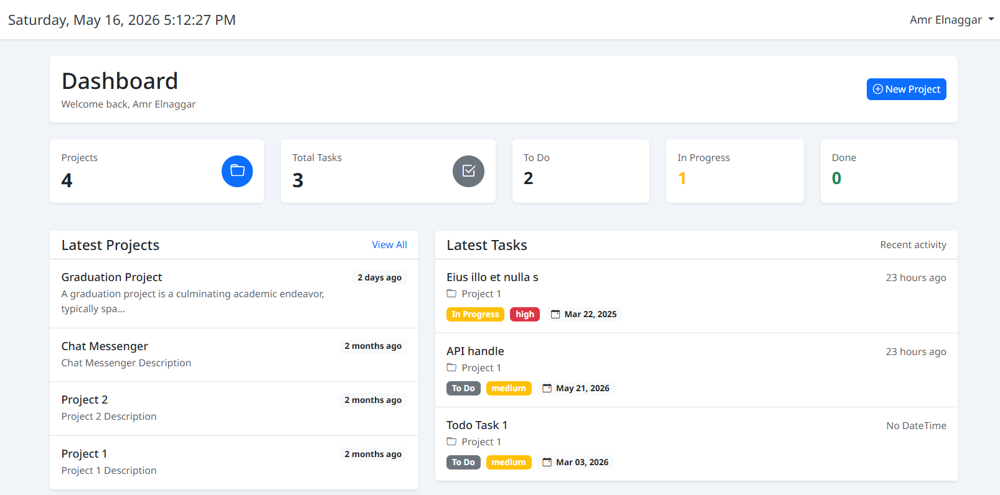
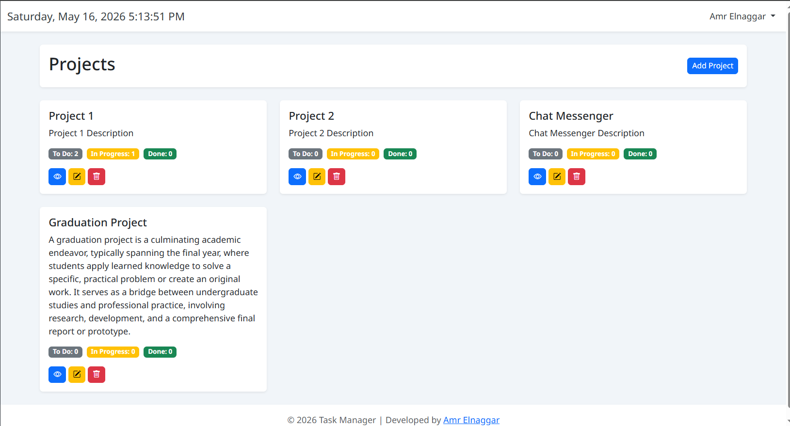
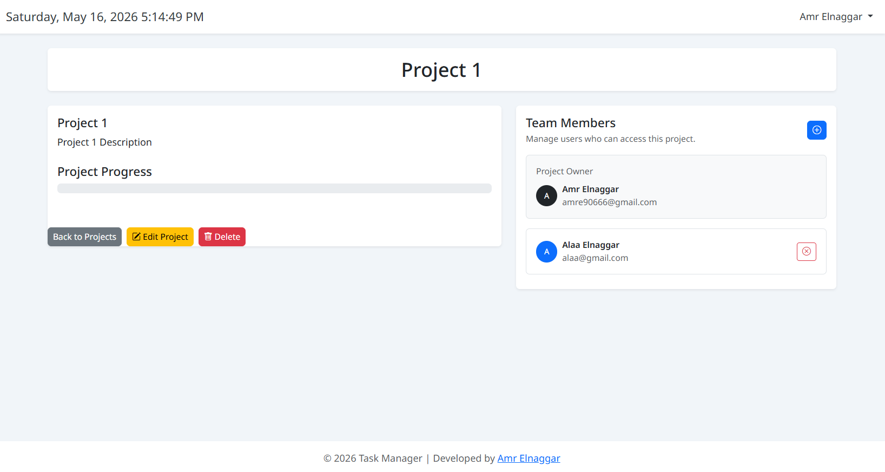
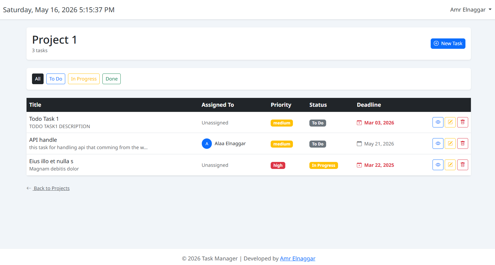
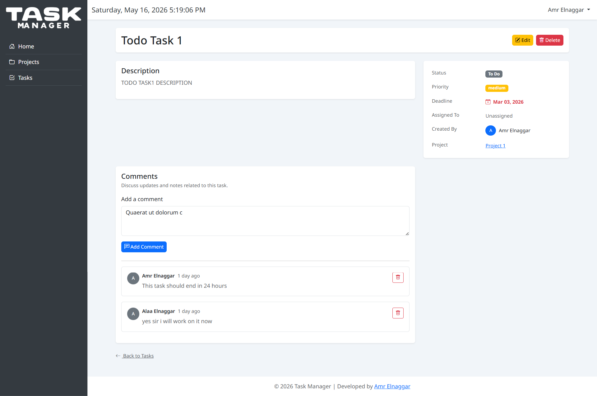
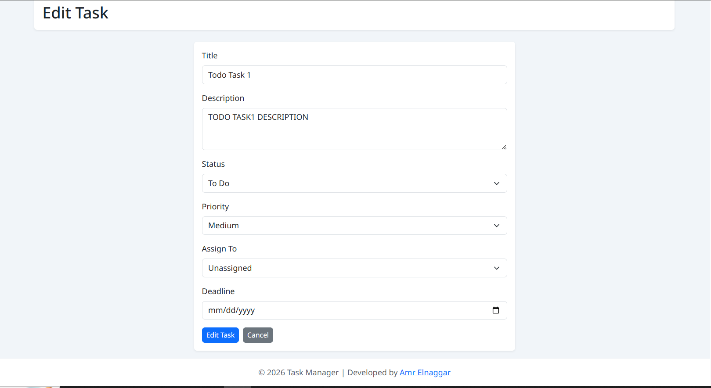

# Collaborative Task Management Platform

A Laravel-based project and task management application built to support team collaboration, task ownership, project membership, deadline tracking, activity monitoring, secure file attachments, and task checklists.

The project was developed as a backend-focused Laravel learning project, with emphasis on real-world authorization rules, Eloquent relationships, validation, database design, maintainable workflows, and GitHub-based version control.

---

## Project Status

The application is under active development.

Current stable version:

```text
v1.10.0
```

The current focus is improving documentation, automated testing, code quality, user experience, and production readiness.

## Demo

A live demo will be added during the deployment phase.

## Screenshots

The screenshots below represent earlier project versions.

Updated screenshots will be added after the planned user-interface redesign.

### Dashboard



### Projects



### Project Details



### Tasks Index



### Task Details



### Edit Task


## Main Features

### Authentication

- User registration
- User login and logout
- Email verification
- Profile management
- Laravel Breeze authentication flow

### Project Management

- Create projects
- View accessible projects
- Update owned projects
- Delete owned projects
- Display project owner information
- Manage project members

### Project Members

- Add registered users by email
- Remove project members
- Prevent duplicate membership
- Prevent adding the project owner as a member
- Restrict member management to the project owner

### Task Management

- Create tasks inside projects
- View project tasks
- Update permitted tasks
- Delete permitted tasks
- Assign tasks to project team users
- Leave tasks unassigned
- Track task status
- Track task priority
- Track task deadline

### Task Assignment

Tasks can only be assigned to:

- The project owner
- Current project members
- No user, using the unassigned option

Unrelated users cannot be assigned manually.

### Task Status Workflow

Task creators and current assignees can update task status through a dedicated status endpoint.

Supported statuses:

- To Do
- In Progress
- Done

The status endpoint accepts only the status field and does not allow unrelated task data to be changed.

### Task Comments

- Add comments to accessible tasks
- Display comments in chronological order
- Delete comments based on authorization
- Record comment activity in the project activity log

### Advanced Task Filters

Tasks can be filtered by:

- Task title
- Status
- Priority
- Assignee
- Unassigned state
- Overdue deadline
- Due today
- Upcoming deadline
- No deadline

Multiple filters can be combined.

### Task Sorting

Tasks can be sorted by:

- Newest first
- Oldest first
- Closest deadline
- Furthest deadline
- Priority
- Status

Sorting works together with task filters.

### Deadline Alerts

The dashboard displays:

- Overdue tasks
- Tasks due today
- Upcoming deadlines

Completed tasks are excluded from active deadline alerts.

### Dashboard Overview

The dashboard includes:

- Project statistics
- Created task statistics
- Assigned task statistics
- Recent projects
- Recent created tasks
- Recent assigned tasks
- Deadline alerts

Assigned tasks are shown only when the user still has access to the related project.

### Project Statistics

Project details include:

- Total tasks
- To Do tasks
- In Progress tasks
- Done tasks
- Completion percentage
- Visual progress bar

### Activity Log

Important project actions are recorded, including:

- Task creation
- Task status updates
- Task deletion
- Member addition
- Member removal
- Comment creation
- Comment deletion
- Attachment upload
- Attachment deletion
- Checklist item creation
- Checklist item completion
- Checklist item reopening
- Checklist item deletion

Each activity displays:

- Activity type
- Acting user
- Description
- Timestamp
- Contextual icon
- Contextual badge color

### Secure Task Attachments

Authorized users can:

- Upload task attachments
- Download task attachments
- Delete permitted attachments

Supported file types:

- JPG
- JPEG
- PNG
- PDF
- DOC
- DOCX
- TXT
- ZIP

Maximum file size:

- 5 MB

Attachment security includes:

- Private file storage
- UUID-based stored filenames
- Original filename preserved for display and download
- Authorization before download
- Validation of file type and size
- Missing files return a 404 response
- Unsupported executable files are rejected
- Stored files are removed when database persistence fails

### Task Checklists

Authorized users can:

- Add checklist items
- Mark checklist items as completed
- Reopen completed items
- Delete permitted checklist items

Task checklist information includes:

- Completed items count
- Total items count
- Completion percentage
- Visual progress bar
- Checklist creator
- Creation timestamp
- Completed item styling

## Technical Highlights

- Laravel MVC architecture
- Blade templates with Bootstrap
- Laravel Breeze authentication
- Policy-based authorization
- Eloquent relationships
- Server-side validation using Laravel validation rules
- Route model binding
- Custom authorization abilities
- Dedicated task status endpoint
- Private attachment storage
- UUID attachment filenames
- Database foreign key constraints
- Cascade delete behavior
- Null-on-delete behavior
- Activity logging
- Query filtering
- Custom sorting logic
- Eager loading
- Collection-based progress calculations
- Feature branch workflow
- Pull request workflow
- Semantic versioning
- GitHub release documentation

## Tech Stack

- PHP 8.2+
- Laravel 12
- Blade
- Bootstrap
- MySQL
- Laravel Breeze
- Eloquent ORM
- Doctrine DBAL
- Pest
- Laravel Pint
- Vite
- Git
- GitHub

## Architecture Overview

The project follows Laravel's MVC structure.

### Controllers

Controllers handle:

- HTTP request workflows
- Validation
- Authorization
- Database operations
- Redirect responses
- Activity logging coordination

### Models

Eloquent models define:

- Database relationships
- Attribute casting
- Mass assignment rules
- Accessors
- Reusable model behavior

### Policies

Policies protect:

- Projects
- Tasks
- Comments
- Attachments
- Checklist items

Authorization rules consider:

- Project ownership
- Current project membership
- Task creation ownership
- Current task assignment
- Resource ownership

### Views

Blade templates render the interface using Bootstrap components.

The interface currently includes:

- Sidebar navigation
- Dashboard cards
- Project pages
- Task lists
- Filters
- Forms
- Progress bars
- Badges
- Activity log
- Attachments
- Checklist items
- Comments

### Storage

Task attachments are stored outside the public directory.

Downloads are handled through authorized controller actions instead of public file URLs.

## Core Database Relationships

### User

A user can:

- Own many projects
- Belong to many projects
- Create many tasks
- Be assigned many tasks
- Write many comments
- Upload many attachments
- Create many checklist items
- Create many activity records

### Project

A project:

- Belongs to an owner
- Has many members
- Has many tasks
- Has many activities

### Task

A task:

- Belongs to a project
- Belongs to a creator
- May belong to an assignee
- Has many comments
- Has many attachments
- Has many checklist items

### Comment

A comment:

- Belongs to a task
- Belongs to a user

### Task Attachment

A task attachment:

- Belongs to a task
- Belongs to an uploader
- Stores file metadata
- References a privately stored file

### Task Checklist Item

A checklist item:

- Belongs to a task
- Belongs to a creator
- Stores completion state
- Stores an optional completion timestamp

### Activity

An activity:

- Belongs to a project
- Belongs to an acting user
- Stores an activity type
- Stores a readable description

## Authorization Rules

### Projects

- Project owners can update and delete their projects.
- Project owners can add and remove project members.
- Project owners and current members can view accessible projects.
- Outsiders cannot access project data.

### Tasks

- Accessible project users can view project tasks.
- Full task editing is restricted by the task policy.
- Task assignment is limited to the project owner and current members.
- Users removed from a project lose access to related task actions.

### Task Status

Task status can be updated by:

- Task creator
- Current task assignee

The user must still have access to the project.

### Comments

- Users who can view a task can add comments.
- Comment owners can delete their comments.
- Project owners can delete project task comments.

### Attachments

Attachments can be uploaded by:

- Project owner
- Task creator
- Current task assignee

Attachments can be downloaded by:

- Project owner
- Current project members

Attachments can be deleted by:

- Project owner
- Task creator
- Attachment uploader

All attachment actions require current access to the project.

### Checklist Items

Checklist items can be created and updated by:

- Project owner
- Task creator
- Current task assignee

Checklist items can be deleted by:

- Project owner
- Task creator
- Checklist item creator

All checklist actions require current access to the project.

## Screenshots

The screenshots currently available represent earlier project versions.

Updated screenshots will be added after the planned user-interface redesign.

Current screenshots:

- Dashboard
- Projects
- Project Details
- Tasks Index
- Task Details
- Edit Task

## Installation

### Requirements

Make sure the following software is installed:

- PHP 8.2 or later
- Composer
- Node.js
- npm
- MySQL
- Git

### Clone the Repository

```bash
git clone https://github.com/AmrElnaggarDev/task_manager.git
cd task_manager
```

### Install PHP Dependencies

```bash
composer install
```

### Install Frontend Dependencies

```bash
npm install
```

### Create the Environment File

On Windows:

```bash
copy .env.example .env
```

On Linux or macOS:

```bash
cp .env.example .env
```

### Generate the Application Key

```bash
php artisan key:generate
```

### Configure the Database

Update the database values inside `.env`:

```env
DB_CONNECTION=mysql
DB_HOST=127.0.0.1
DB_PORT=3306
DB_DATABASE=task_manager
DB_USERNAME=root
DB_PASSWORD=
```

### Run Database Migrations

```bash
php artisan migrate
```

### Build Frontend Assets

For development:

```bash
npm run dev
```

For production:

```bash
npm run build
```

### Start the Application

```bash
php artisan serve
```

The application will normally be available at:

```text
http://127.0.0.1:8000
```

## Running the Project

For a normal local development session, run:

```bash
php artisan serve
```

In another terminal:

```bash
npm run dev
```

The repository also includes a Composer development command:

```bash
composer run dev
```

This command starts:

- Laravel development server
- Queue listener
- Vite development server

## Testing

The project currently relies mainly on documented manual testing.

Pest and Laravel Pest support are installed, but a complete automated feature test suite is still planned.

Run the current test command using:

```bash
composer test
```

Or:

```bash
php artisan test
```

Planned automated test coverage includes:

- Project authorization
- Task authorization
- Assignment validation
- Task status updates
- Attachment security
- Checklist permissions
- Activity logging
- Filtering and sorting
- Membership access rules

## Code Style

Laravel Pint is installed for code formatting.

Format the project using:

```bash
vendor/bin/pint
```

Check formatting without modifying files:

```bash
vendor/bin/pint --test
```

## Main User Flow

1. Register a new account or log in.
2. Create a project.
3. Add registered users as project members.
4. Create tasks inside the project.
5. Assign tasks to the project owner or members.
6. Set task priority and deadline.
7. Track task status.
8. Use filters and sorting to find tasks.
9. Add comments to discuss task progress.
10. Upload secure task attachments.
11. Break tasks into checklist items.
12. Monitor project activity.
13. Review dashboard statistics and deadline alerts.

## Release History

- v0.1.0 — Initial Database Migrations
- v0.2.0 — Eloquent Models and Relationships
- v0.3.0 — Authentication
- v0.4.0 — Project Management
- v0.5.0 — Task Management
- v0.6.0 — Dashboard Overview
- v0.7.0 — Project Members Management
- v0.8.0 — Task Comments
- v0.9.0 — Project Team Task Assignment
- v1.0.0 — First Stable Release
- v1.1.0 — Activity Log
- v1.2.0 — Advanced Task Filters
- v1.3.0 — Deadline Alerts
- v1.4.0 — Project Statistics
- v1.5.0 — Activity Log Polish
- v1.6.0 — Task Sorting
- v1.7.0 — Assigned Tasks Dashboard
- v1.8.0 — Assignee Task Status Updates
- v1.9.0 — Secure Task Attachments
- v1.10.0 — Task Checklists

## Roadmap

### Documentation and Presentation

- Update project screenshots
- Add database ERD
- Add architecture diagram
- Add a live demo
- Add demo credentials

### Testing and Quality

- Add automated feature tests
- Add authorization tests
- Add file upload tests
- Add checklist tests
- Add GitHub Actions
- Add automated Pint checks
- Add test status badges

### User Experience

- Redesign dashboard hierarchy
- Improve task details layout
- Improve responsive behavior
- Standardize cards, badges, forms, and buttons
- Add accessible labels and tooltips
- Improve empty states
- Improve navigation

### Planned Features

- Database notifications
- Email notifications
- Queued notification delivery
- User roles inside projects
- Comment editing
- Task due-date reminders
- Project invitations
- Audit history improvements
- REST API
- API authentication
- Pagination
- Search improvements

### Production Readiness

- Deployment
- Environment hardening
- Production database seeding
- Error monitoring
- Database backups
- Queue worker configuration

## Known Limitations

- No live deployment is available yet.
- Automated feature test coverage is still limited.
- Notifications are not implemented yet.
- Project roles are currently basic.
- Comments cannot be edited.
- The current user interface will be redesigned.
- API endpoints are not available yet.
- Pagination is not yet applied to every large collection.

## Development Workflow

The project is developed using:

- A dedicated feature branch
- Focused commits
- Pull request documentation
- Manual testing
- Merge into main
- Semantic version tag
- GitHub release notes

Example branch names:

```text
feature/task-checklist
feature/task-attachments
docs/portfolio-readme
```

Example commit format:

```text
feat(task-checklist): add task checklist items
docs(portfolio): update project documentation
```

## Portfolio Summary

This project demonstrates practical Laravel development skills through a collaborative project-management system with real authorization rules, secure resources, relational data, workflow tracking, and documented release management.

Key demonstrated skills:

- Laravel backend development
- Database relationship design
- Policy-based authorization
- Secure file handling
- Validation
- Blade and Bootstrap integration
- Git and GitHub workflow
- Feature planning
- Incremental versioned development

## Author

Built by [Amr Elnaggar](https://github.com/AmrElnaggarDev)
